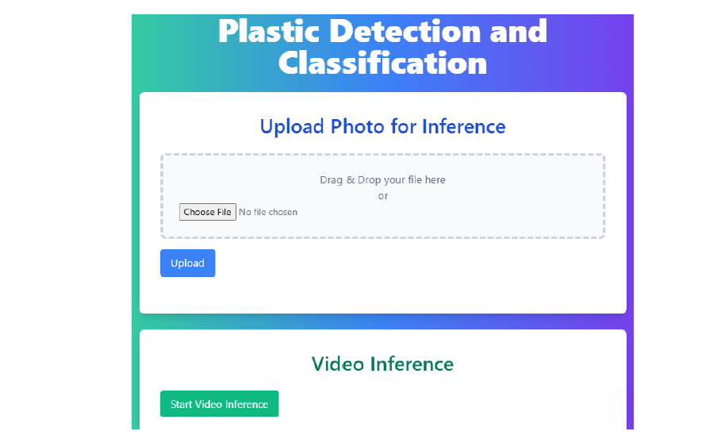
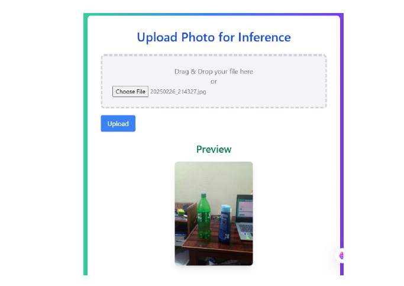
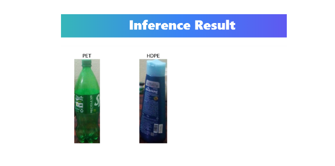
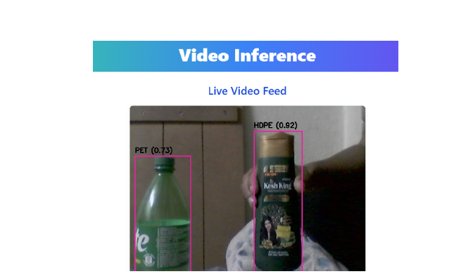

# 🌟 Plastic Detection and Classification 🌟
## 📋 Table of Contents
- [Introduction](#introduction)
- [Installation](#installation)
- [Running the Project](#running-the-project)
- [Usage](#usage)
  - [Upload Photo for Inference](#upload-photo-for-inference)
  - [Live Video Inference](#live-video-inference)
- [Contributors](#contributors)

## Introduction
This project is done in partial fulfillment of Bachelor's degree in computer engineering as a Minor Project. It leverages YOLO and a CNN model to detect and classify different types of plastics from images and live video feeds.

### 1. Web interface
You can run inference on images or live video feeds through this web interface.


### 2. Photo inference
Drag and drop or browse your image through **Choose File** button and then click **Upload**. 


After clicking upload button you will see the output of the inference as shown below.


### 3. Live video inference
Click on the **Start Video Inference** button on the [Web interface](#1-web-interface) and it will start.


For more info please read [Project Report PDF](./project_report.pdf)

Click here for  [Demo Video](https://drive.google.com/file/d/1_Za4BeSZkGNh6Ts-ZJZb3wCuXeg2wIen/view?usp=sharing)


## Installation
Follow these steps to set up the project on your local machine:

1. **Clone the repository:**
    ```bashv
    git clone https://github.com/yourusername/plastic-detection.git
    cd plastic-detection
    ```

2. **Create a virtual environment:**
    ```bash
    python -m venv myenv
    ```

3. **Activate the virtual environment:**

    - On Windows:
        ```bash
        myenv\Scripts\activate
        ```

    - On macOS/Linux:
        ```bash
        source myenv/bin/activate
        ```

4. **Install the required packages:**
    ```bash
    pip install -r requirements.txt
    ```

## Running the Project
1. Make sure the folder looks like this 

    ```plaintext
    minor-project/
    │
    ├── app.py
    ├── requirements.txt
    ├── README.md
    │
    ├── yolo_weights/
    │   └── yolov9s_trained_best.pt
    │   └── Yolov9t_trained_best.pt
    │
    ├── CNN models/
    │   └── Best.keras
    │   └── Pabin_classification.keras
    │
    ├── uploads/
    │   └── (uploaded images and output.png will be saved here)
    │
    ├── templates/
    │   └── index.html
    │   └── inference.html
    │   └── video_inference.html
    │
    ├── screenshots/
    │   └── Interface.png
    │   └── Uploading_photo.png
    │   └── photo_inference.png
    │   └── video_inferrence.png
    │
    └── (other files and folders as needed)
    ```

2. Start the Flask application:
    ```bash
    python app.py
    ```

3. Open your web browser and go to `http://127.0.0.1:5000/`.


## Contributors

- Jesis Upadhayaya (THA078BCT017)
- Kamal Shrestha (THA078BCT018)
- Pabin Khanal (THA078BCT027)
- Prajwal Chaudhary (THA078BCT028)

---

Feel free to reach out to us if you have any questions or suggestions! 😊
## 📧 Contact

For any questions or suggestions, feel free to reach out to us at:

- Prajwal Chaudhary: [prajwalchy25@gmail.com](mailto:prajwalchy25@gmail.com)
